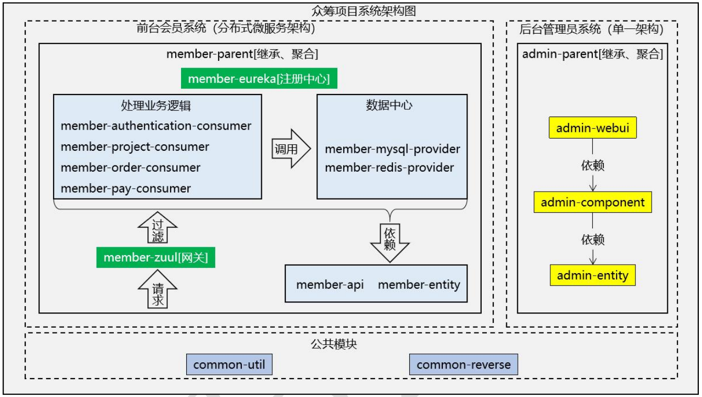
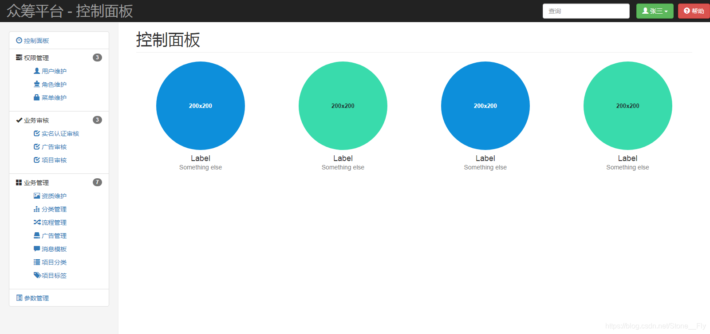
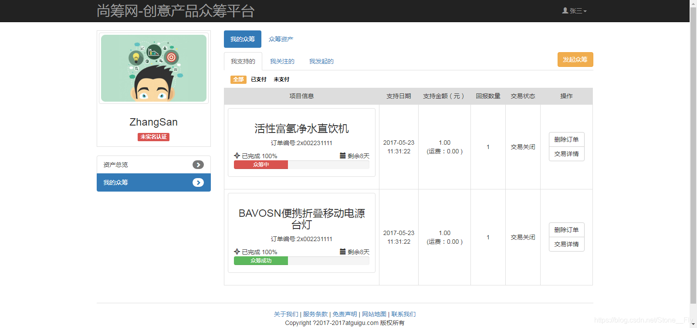
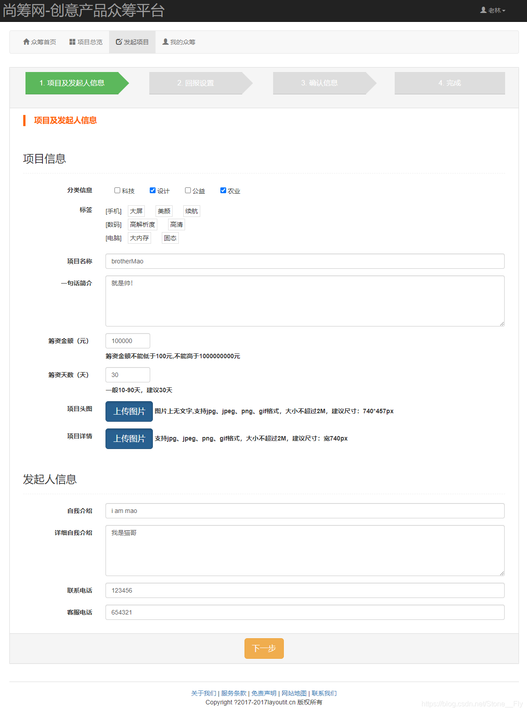

# FundsOnline
**fundsonline.com** - A financing platform that helps entrepreneurs publish entrepreneurial projects and raise start-up funds from the public.

## 1 Project Description
**fundsonline.com** is an online crowdfunding platform that supports entrepreneurial projects by raising funds from the general public, and supporters can receive returns equivalent to the amount of support.

## 2 Project Functions
The business functions of **fundsonline.com** include:
1. Users views crowdfunding projects
2. Users views crowdfunding project details
3. User supports Project
4. User views personal center
5. Users initiates crowdfunding
6. Administrator login
7. Administrator maintains data
8. Administrator maintains role data
9. Administrator maintains menu data
10. Administrator control permissions

## 3 Project Structure
This project can be divided into two parts: backend management and frontend membership. Its overall framework diagram is as follows:

### 3.1 Backend management system
The backend management system has a single architecture, implemented by the SSM framework, and integrates SpringSecurity to control user permissions. The picture below shows the control panel page of the backend management system. You can see that the backend management mainly has three major functions, namely authority management, business review and business management. Although the Shangcho.com project has only completed the permission management part, it is enough for us to be familiar with the SSM framework.

### 3.2 Front desk membership system
The front-end membership system is a distributed microservice architecture, implemented by SpringBoot + SpringCloud. At the same time, it integrates the oss service for uploading project pictures, and integrates Alibaba's payment API for payment. The picture below shows the user center page of the front-end membership system. Since the  **fundsonline.com** project is mainly used for teaching, most of the data in the picture is fake data. The most important function of this page is to initiate crowdfunding:

The picture shows the page after clicking to initiate crowdfunding:

## 4 Development / Deployment Environment

Аппаратные среды, использованные для разработки, показаны в Таблице 1:

*Таблица 1. Hardware environments*

| Item | Specification | Comments |
| ---- | ---- | ---- |
| CPU | AMD Ryzen 5 5600H with Radeon Graphics 3.30 GHZ | - |
| RAM | 16.0 GB | Software uses up to 1 GB |
| Operating System | Windows 10 Professional | - |

The software environments used in development are shown in Table 1:

*Таблица 2. Software enviroments*

| Item | version | Comments |
| ---- | ---- | ---- |
| Java | 8u121 | This or higher version |
| IntelliJ IDEA | 2023.2.2 (Educational Edition) | This or higher version |
| MySQL | 8.0.35 Community | This or higher version |
| Redis | 4.0.2 | This or higher version |
| Checkstyle | 8.1 | This or higher version |
| JUnit | 5.7.0 | This or higher version |

## 5 Test Environment
а) название приложения и ссылка, где оно находится в Интернете (если это open-source приложение), год выпуска приложения (разрешённый период с 2019 по настоящее время)
- название приложения: **fundsonline.com**
- ссылка: https://github.com/liyijiadou2020/FundsOnline.git

б) язык программирования <название и версия>;
- язык программирования: Java 8u121

в) размер всего приложения или размер фрагмента кода, который вы будете проверять, если размер приложения больше 1К (в исходных строках кода);
 - размер фрагмента кода, который вы будете проверять: 300 lines

г) среда разработки <название и версия>;
- среда разработки: IntelliJ IDEA 2023.2.2 Educational Edition

д) выбранные ДВА инструмента для статического анализа кода <название и версия>;
- выбранные ДВА инструмента для статического анализа кода:
	- Checkstyle 8.1
	- IntelliJ IDEA 2023.2.2 Educational Edition

е) выбранный фреймворк для разработки и выполнения модульных тестов
- JUnit 5.7.0

---

# ГЛАВА 1. СТАТИЧЕСКИЙ АНАЛИЗ

## 1.1 Инструмент статического анализа

## 1.2 Установка и конфигурирование

## 1.3 Разбор некоторых групп опций анализатора

## 1.4 Запуск анализатор для кода всего проекта

## 1.5 Запуск анализатора для выбранного фрагмента кода

## 1.6 Вывод

# 2 СПИСОК ИСТОЧНИКОВ